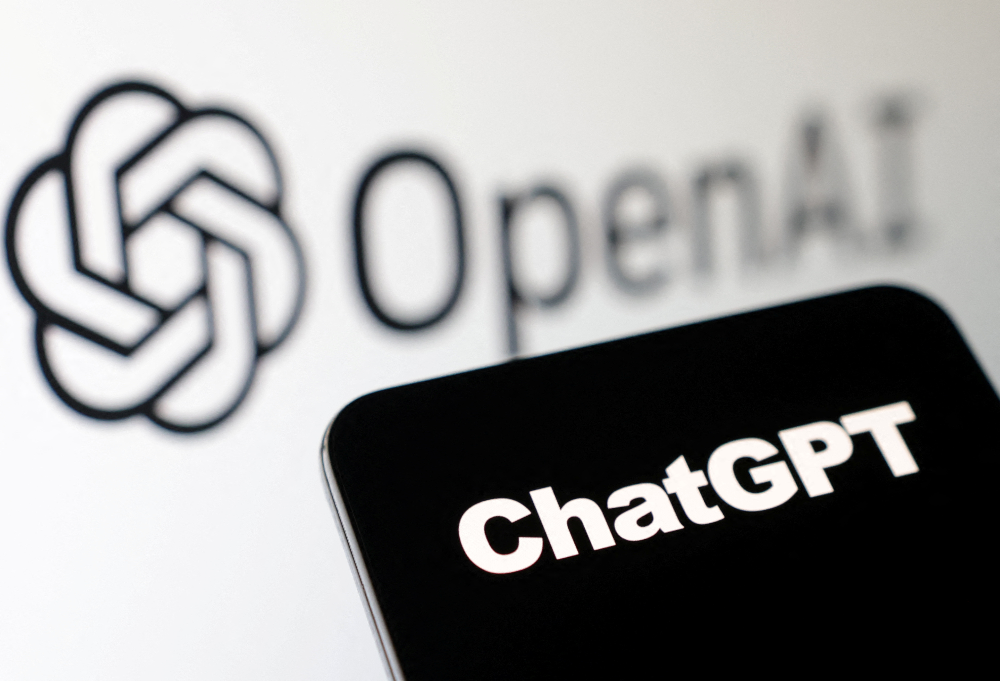

# Essential Question

Should we pause significant advances in Artificial Intelliegence in order to build guidelines?

Yes, we should the reason being is at the current rate Artificial Intelliegence is developing it is outpacing the rate proper guidelines are being put in place in order to secure safety and security.

## Support

Support for this claim can be found in the open letter [Pause Giant AI Experiments: An Open Letter](https://futureoflife.org/open-letter/pause-giant-ai-experiments/). In this letter it states "Advanced AI could represent a profound change in the history of life on Earth, and should be planned for and managed with commensurate care and resources. Unfortunately, this level of planning and management is not happening, even though recent months have seen AI labs locked in an out-of-control race to develop and deploy ever more powerful digital minds that no one – not even their creators – can understand, predict, or reliably control.". This rush development of AI could lead to AI systems that dont care about ethics and cause problems in the near future. One of the solutions drafted in the letter is to pause AI developments for 6 months and to work with policymakers in order to create governace system for AI. So far this open letter has been signed by Elon Musk, Steve Wozniak, Andrew Yang, Yi Zeng, Gary Marcus and other AI experts.

## What the opposition says

Not everyone supports pausing AI development in order to put in proper safeguards. Their argument is such measures would slow humanities progression down and would cause more problems than good. I disagree with this argument against pausing advances in AI because without the proper guidelines in place AI could cause significantly worse problems in the future some of these problems are already starting to appear for example according to [Bloomberg](https://www.bloomberg.com/news/articles/2023-05-01/ibm-to-pause-hiring-for-back-office-jobs-that-ai-could-kill#xj4y7vzkg) IBM has paused hiring on jobs that could be replaced by AI.

## Connection

How does this relate back to Dune?

In the book Dune we learn about thinking machines which have been abolished by the government after a war broke out between humans and thinking machines. This connect with the current issue we are having with Ethical AI because science fiction stories in a way serve as a warning to society of dangers that lay ahead. Dune serves as a warning of the possible dangers of AI if we dont create the proper guidelines.

## What are some safeguards that could be put in place

We have now already discussed the Ethical Issues caused by AI. Now lets talk about possible solutions to these Issues.

+ Build awareness
    + So far AI is still in its early age and building awareness about these possible issues is a temporary solution.
+ Explainable outputs
    + As of right now AI is kind of a black box. Having explainable outputs will give both the creators and users of AI a measure on how accurate information is.
+ Privacy by Design
    + Building AI to have privacy in mind by design will increase the safety of using it.

